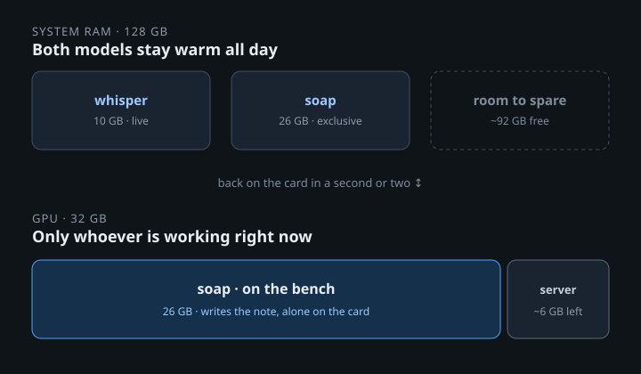

# SilkAI

[](https://github.com/andrecolin/silkai/actions/workflows/ci.yml)
[](LICENSE)

SilkAI is not a new model runner and not a cloud cluster. We only decide who
is on the GPU, who waits, and who stays warm in RAM.

That makes switching models a matter of one to three seconds instead of
twenty or more. A parked model keeps its weights in RAM, so bringing it back
is a copy across the bus, not a cold load off disk. You stop designing around
the wait.

One machine, one graphics card, plenty of system RAM, and more models than
the card can hold at once. That is most workstations and small servers.
Today each program loads its own model and leaves it there, so the next one
fails to load or never starts. SilkAI is the one process that owns the card:
it loads the model a request names, packs together the ones that fit, parks
the idle ones, and brings them back when they are asked for.

Apps talk to it over OpenAI-style HTTP, or open a session socket to pin a
model on the card while they talk to that engine directly. The rules, who may
share the card, who must have it alone, and who is live, sit in one config
file rather than in every request.

[MIT](LICENSE) · [Ko-fi](https://ko-fi.com/andrecolin)

## One card, two models

A doctor's office. Say the card has 32 GB and the box has 128 GB of RAM.
Two models are needed, and they do not fit on the card together:

| model | job | needs | policy |
|---|---|---|---|
| `whisper` | speech to text while the doctor dictates | about 10 GB | **live**: never interrupted, two people can share it |
| `soap` | turns the transcript into a SOAP note | about 80% of the card | **exclusive**: needs the card to itself |

Here is a visit, as SilkAI sees it:

1. **The doctor starts dictating.** The app opens a session for `whisper`.
   SilkAI puts it on the card and holds it there for as long as the socket
   is open.
2. **Dictation ends; the app asks `soap` for the note.** `soap` needs the
   card alone. SilkAI parks `whisper`, loads `soap`, and streams the note
   back. A second note request waits in line on the one loaded copy; there
   is no second 26 GB load.
3. **The next patient walks in.** The app opens a `whisper` session again.
   `whisper` is live, so it wins: `soap` is parked and `whisper` is back on
   the card in a second or two. If `soap` was still loading when the request
   came in, that load is abandoned rather than waited for.



SilkAI carries text, not audio. The app sends speech to the speech engine
directly; SilkAI's job is to keep that engine on the card while the doctor
is talking and to move it aside when the writer needs the whole card. The
same two roles fit a coding setup: an autocomplete model held live while you
type, and a large model for the hard question. A third model small enough to
ride along in the leftover space can be added with `priority = "background"`;
two is enough to show the idea.

What that adds up to:

- **Fit together, run together.** What fits shares the card. A model that
  needs the whole card waits, then runs alone.
- **Live work wins.** A live model is never bumped, and a live request
  arriving during a long load interrupts that load instead of queueing
  behind it.
- **One loaded copy, many requests.** Slots let several requests share one
  resident model.
- **Parked, not unloaded.** An idle model gives up the card, not its place.
  It comes back from RAM in one to three seconds, a little longer for a very
  large one; not a cold start off disk.
- **Policy in the config.** Clients only send a model name. A script cannot
  take the card from something live.

## Quickstart

Needs Rust 1.88+ ([rustup](https://rustup.rs)) and a
[llama.cpp](https://github.com/ggml-org/llama.cpp) build with `llama-server`
on your `PATH`. SilkAI starts and stops it for you; the default build has no
CUDA in it and does not need any. (An optional in-process engine can be built
against CUDA; see [Engines](#engines).)

```bash
cargo install silkai --locked
silkai init                             # probes GPU and RAM, writes ~/.config/silkai/config.toml
$EDITOR ~/.config/silkai/config.toml    # point --model at a GGUF, set vram_gb
silkai check                            # verifies every path and prints the plan
silkai                                  # runs on 127.0.0.1:8080
curl -s http://127.0.0.1:8080/v1/chat/completions \
  -H 'content-type: application/json' \
  -d '{"model":"chat","messages":[{"role":"user","content":"Hello"}]}'
```

`silkai init` writes one model. Add a `[models.*]` block per model after
that; `examples/llama-server.toml` is the setup above with real flags.

## Configure

The config is `~/.config/silkai/config.toml`, or whatever `SILKAI_CONFIG` or
`--config` points at. The daemon listens on `127.0.0.1` only.

```toml
listen = "127.0.0.1:8080"

[resources]
gpu_headroom_gb = 3        # left free on each card for the rest of the machine and the driver
ram_headroom_gb = 16       # left free for the OS
prefetch_on_start = true   # warm keep_warm models at start
request_timeout_secs = 600
```

Card and RAM sizes are probed (`nvidia-smi`, `/proc/meminfo`, or
`sysctl hw.memsize`). Set `gpu_total_gb` and `ram_total_gb` to override them
or when there is nothing to probe; without either, the daemon refuses to
start. Headroom is what SilkAI promises not to touch.

The two models from the story, each a child process that SilkAI starts and
stops:

```toml
# The speech engine. Any ASR server will do; SilkAI only starts it, waits
# for GET /health, and keeps it on the card. Audio goes to it directly.
[models.whisper]
engine = "process"
path = "whisper"                       # the name clients send
url = "http://127.0.0.1:8101"          # must match the port below, and serve /health
cmd = ["env", "WHISPER_MODEL=large-v3",
       "your-asr-server", "--host", "127.0.0.1", "--port", "8101"]
vram_gb = 10                           # what the whole service holds on the card
priority = "live"
slots = 2
transport = "both"                     # HTTP and a session socket
idle_timeout_secs = 900

# The note writer, under llama-server.
[models.soap]
engine = "process"
path = "soap"
url = "http://127.0.0.1:8102"
cmd = ["llama-server", "--model", "/models/soap-writer.gguf",
       "--alias", "soap", "--host", "127.0.0.1", "--port", "8102",
       "--n-gpu-layers", "999", "--jinja"]
vram_gb = 26
priority = "normal"
exclusive = true
```

| field | meaning |
|---|---|
| `vram_gb` | what the model takes on the card, weights plus context. The budget SilkAI packs by. |
| `priority` | `live` is never bumped and preempts the others; `normal` is the default; `background` fills leftover space and leaves first. |
| `exclusive` | needs the card alone. On several cards, alone on *its* card. |
| `slots` | requests that may share one loaded copy. Match the engine's own limit (`--parallel` for llama-server). |
| `keep_warm` | park on idle (default) rather than unload. |
| `transport` | `http` (default), `websocket`, or `both`. |
| `idle_timeout_secs` | close an idle session socket after this long (default 45). |
| `ram_gb` | RAM held while parked, if not the same as `vram_gb`. |
| `ctx_size` | context window for the in-process llama.cpp engine (default 4096). |

A model larger than any card's schedulable memory is listed but disabled;
`silkai check` says so.

There is no `env` key: put `env VAR=value` at the front of `cmd` when a child
needs a variable. `vram_gb` is what the *process* holds, not what the weights
weigh. A Python service can hold far more than its model: faster-whisper on
CTranslate2 with torch loaded for VAD has two CUDA contexts in one process,
and `GET /v1/status` reports what the driver measures beside the budget you
set, so you can correct it.

## Engines

**`process`, the one to use.** SilkAI runs the command, waits for
`GET /health` to answer 200 (llama-server says 503 while the GGUF loads;
up to five minutes), and talks OpenAI chat to it. Parking kills the process
group; the next wake starts it again, which is fast from the page cache. The
child gets `CUDA_VISIBLE_DEVICES` set to the card SilkAI chose, and its
stderr goes to SilkAI's log. Anything that speaks OpenAI chat and has a
health endpoint works: `llama-server`, `vllm serve`, and the like.

**`vllm`**, for a vLLM you run yourself. SilkAI posts `/wake_up` and
`/sleep?level=1` (start vLLM with `VLLM_SERVER_DEV_MODE=1` and
`--enable-sleep-mode`) and streams `/v1/chat/completions`. It does not start
or stop the process.

```toml
engine = "vllm"
path = "Qwen/Qwen3-0.6B"          # model id sent to vLLM
url = "http://127.0.0.1:8000"     # default
gpu = 0                           # the card vLLM is on
```

**`ollama`**, for an Ollama you run yourself. Wake is `/api/generate` with
`keep_alive = -1`, park is `keep_alive = 0` (Ollama has no parked state),
chat is `/api/chat`.

```toml
engine = "ollama"
path = "llama3.2"                 # Ollama model name
url = "http://127.0.0.1:11434"    # default
```

**`llama.cpp`, in-process and experimental.** Built into the daemon with
`--features llama` plus one of `cuda`, `vulkan`, or `metal`. It renders the
chat through the GGUF's own template and honours `ctx_size`, but it re-reads
the file on every wake instead of holding a parked copy, and it serves one
request at a time per model. Prefer `process` with `llama-server`; see
[Building the in-process engine](#building-the-in-process-engine) if you
want it anyway.

**`fake`**, for tests. No GPU needed; the scheduler is exercised with GB
numbers.

## Talk to it

`POST /v1/chat/completions` takes the OpenAI shape. The whole `messages`
list reaches the engine, so system prompts and history work; `content` may
be a string or a list of text parts; `max_tokens`, `temperature`, and
`"stream": true` are honoured. Replies carry `id`, `model`, `created`, and
`finish_reason`; streams open with a role chunk and end with a stop chunk
then `[DONE]`. The official SDKs work as they are:

```python
from openai import OpenAI
client = OpenAI(base_url="http://127.0.0.1:8080/v1", api_key="unused")
client.chat.completions.create(model="soap", messages=[{"role": "user", "content": "..."}])
```

`GET /v1/models` lists the configured names. Errors return the reason in
the body: an unknown model is 404, a disabled one 400, a prompt the engine
cannot take (too long for its window) 400, an engine failure 500. If an
engine fails, that job fails, the copy is marked not resident, and the next
request loads it again; the daemon stays up. A request preempted mid-stream
resumes from the tokens already sent; the client never sees a prefix twice.

**Sessions.** Any model with `transport = "websocket"` or `"both"` takes
`GET /v1/session?model=whisper`. The socket says `queued`, then `live`; from
then on the model stays on the card until the socket closes or goes idle.
Send `{"type":"prompt","content":"..."}` (or `"messages": [...]` with
`max_tokens` / `temperature`) and read `token` messages until `done`. The
app decides what to do with the text next; SilkAI does not chain models.

A session that only pins a model has nothing to send. Hold it open with a
WebSocket ping or `{"type":"ping"}`; either one restarts the idle timer
without running anything. This is the shape to use for a speech engine: pin
it for as long as the microphone is open, send the audio to the engine
directly, and let SilkAI keep it on the card.

## Watch it

Every daemon serves:

- `GET /v1/status`: each model's state (`cupboard`, `shelf`, `loading`,
  `bench`, `sleeping`), engine, budget, and what the driver measures for
  its process; queue depth and open sessions; per-card budget and measured
  use.
- `GET /v1/events`: the last 500 scheduler events replayed, then live over
  Server-Sent Events. `?after=<seq>` skips the replay.
- `GET /metrics`: the same numbers in Prometheus text format, plus counters
  for loads, wakes, sleeps, preempts, and faults per model.

An optional page draws it: each card to scale with a measured marker, the
parked models, and the event log.

```toml
[ui]
enabled = true          # off by default; http://127.0.0.1:8080/ui
token = "change-me"     # optional; guards /ui, /metrics, /admin/*
```

The token goes in `Authorization: Bearer <token>` from tools, or as the
password when the browser asks. `/v1/*` never needs it. The page loads
nothing from the internet. For access from another machine, put a reverse
proxy with TLS in front; the daemon itself stays on loopback.

`POST /admin/reload` re-reads the config while no job is running. Models
whose block did not change stay where they are; removed or changed ones are
discarded first, then anything new loads. `SIGTERM` or Ctrl-C shuts down
cleanly and takes the child processes with it.

## Several cards

Each card is its own bench; RAM is one shared shelf. List the cards and,
optionally, pin models:

```toml
[[resources.gpus]]
id = 0
total_gb = 32
headroom_gb = 3
[[resources.gpus]]
id = 1
total_gb = 32
headroom_gb = 3

[models.soap]
# ...
gpu = 0            # pin to one card
[models.big]
# ...
gpus = [0, 1]      # one model across two cards; vram_gb is split evenly
```

With no `[[resources.gpus]]`, every card `nvidia-smi` lists is used. An
exclusive model owns *its* card, not the machine, so a large writer on card
0 and an indexer on card 1 run at the same time.

## Install as a service

The install script builds from a checkout, installs to `~/.local/bin`, runs
`silkai init` if there is no config yet, and adds a user systemd unit on
Linux:

```bash
git clone https://github.com/andrecolin/silkai
cd silkai
./scripts/install.sh
systemctl --user enable --now silkai
curl -s http://127.0.0.1:8080/health
```

Or without the script: `cargo install --path crates/silkai --locked`.

### Building the in-process engine

```bash
FEATURES=llama ./scripts/install.sh           # CPU only
FEATURES=llama,cuda ./scripts/install.sh      # NVIDIA, needs the CUDA toolkit
FEATURES=llama,vulkan ./scripts/install.sh    # Linux/Windows, needs the Vulkan SDK
FEATURES=llama,metal ./scripts/install.sh     # macOS
```

Pick one backend; never pass `--all-features`. The build compiles llama.cpp
from source (ten minutes or more) and needs cmake, a C++ compiler, and
libclang headers for bindgen (`libclang-common-18-dev` on Ubuntu, or your
LLVM version's equivalent). With Ubuntu's packaged CUDA toolkit the
libraries live in `/usr/lib/x86_64-linux-gnu` rather than a `lib64`
directory, which the build looks for; point it at a directory that has one:

```bash
mkdir -p ~/cuda && ln -s /usr/lib/x86_64-linux-gnu ~/cuda/lib64
CUDA_LIBRARY_PATH=~/cuda FEATURES=llama,cuda ./scripts/install.sh
```

A toolkit under `/usr/local/cuda` is found on its own.

## Development

```bash
cargo test                      # no GPU needed; the scheduler is tested with GB numbers
cargo test --features llama     # builds llama.cpp (CPU) for the in-process engine's tests
```

The opt-in GPU integration test needs real weights:

```bash
SILKAI_ITEST=1 SILKAI_GGUF_A=/path/tiny.gguf SILKAI_GGUF_B=/path/small.gguf \
  cargo test -p silkai-server --features llama --test itest_llama -- --nocapture
```

Four crates: `silkai-sched` (the scheduler, GB numbers only, no GPU types),
`silkai-adapters` (the engines), `silkai-server` (config, runtime, HTTP), and
`silkai` (the binary). PRs welcome, no CLA; `main` is protected and changes
land through pull requests with green CI. See
[CONTRIBUTING.md](CONTRIBUTING.md), [CHANGELOG.md](CHANGELOG.md),
[CODE_OF_CONDUCT.md](CODE_OF_CONDUCT.md), and [SECURITY.md](SECURITY.md).

## License and coffee

SilkAI is free software under the [MIT License](LICENSE). Use it, fork it,
ship it in a product. If it saves you a second GPU or an afternoon of
restarts, [a coffee is appreciated](https://ko-fi.com/andrecolin). The daemon
does not nag, phone home, or lock features.
